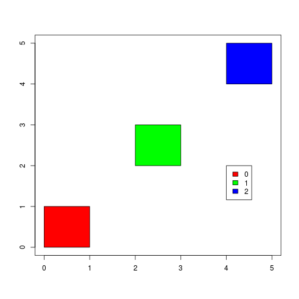

### Introduction

The purpose of this post is to show how to use
[Boost::Geometry library](http://www.boost.org/doc/libs/1_57_0/libs/geometry/doc/html/index.html)
which was introduced
[recently](http://dirk.eddelbuettel.com/blog/2014/12/22/#bh_1.55.0-1) in
Rcpp.  Especially, we focus on
[R-tree data structure](http://www.boost.org/doc/libs/1_57_0/libs/geometry/doc/html/geometry/reference/spatial_indexes/boost__geometry__index__rtree.html)
for searching objects in space because only one spatial index is
implemented - R-tree Currently in this library.

Boost.Geometry which is part of the Boost C++ Libraries gives us algorithms
for solving geometry problems. In this library, the Boost.Geometry.Index
which is one of components is intended to gather data structures called
spatial indexes which are often used to searching for objects in space
quickly. Generally speaking, spatial indexes stores *geometric objects'
representations* and allows searching for objects occupying some space or
close to some point in space.

### R-tree

R-tree is a tree data structure used for spatial searching, i.e., for
indexing multi-dimensional information such as geographical coordinates,
rectangles or polygons. R-tree was proposed by Antonin Guttman in 1984 as an
expansion of B-tree for multi-dimensional data and plays significant role in
both theoretical and applied contexts. It is only one spatial index
implemented in Boost::Geometry.

As a real application of this, It is often used to store spatial objects such
as restaurant locations or the polygons which typical maps are made of:
streets, buildings, outlines of lakes, coastlines, etc in order to perform a
spatial query like "Find all stations within 1 km of my current location",
"Let me know all road segments in 2 km of my location" or "find the nearest
gas station" which we often ask google seach by your voice recenlty. In this
way, the R-tree can be used (nearest neighbor) search for some places.

You can find more explanations about R-tree in
[Wikipedia](http://en.wikipedia.org/wiki/R-tree).

### Write a wrapper class of rtree in Boost::Geometry using Rcpp

Now, we write a simple C++ wrapper class of rtree class in
Boost::Geometry::Index that we can use in R.

The most important feature to mention here is the use of Rcpp module to
expose your own class to R. Although almost all classes in Boost library have
a lot of functions, , you do not use all in many cases. In that case, you
should write your wrapper class for making your code simple.

### Rcpp code


// [[Rcpp::depends(BH)]]

// Enable C++11 via this plugin to suppress 'long long' errors
// [[Rcpp::plugins("cpp11")]]

#include <vector>
#include <Rcpp.h>
#include <boost/geometry.hpp>
#include <boost/geometry/geometries/point.hpp>
#include <boost/geometry/geometries/box.hpp>
#include <boost/geometry/index/rtree.hpp>
using namespace Rcpp;

// Mnemonics
namespace bg = boost::geometry;
namespace bgi = boost::geometry::index;
typedef bg::model::point<float, 2, bg::cs::cartesian> point_t;
typedef bg::model::box<point_t> box;
typedef std::pair<box, unsigned int> value_t;

class RTreeCpp {
public:
  // Constructor.
  // You have to give spatial data as a data frame.
  RTreeCpp(DataFrame df) {
      int size = df.nrows();
      NumericVector id   = df[0]; 
      NumericVector bl_x = df[1]; 
      NumericVector bl_y = df[2]; 
      NumericVector ur_x = df[3]; 
      NumericVector ur_y = df[4]; 
      for(int i = 0; i < size; ++i) {        
          // create a box
          box b(point_t(bl_x[i], bl_y[i]), point_t(ur_x[i], ur_y[i]));
          // insert new value
          rtree_.insert(std::make_pair(b, static_cast<unsigned int>(id[i])));   
      }
  }
  // This method(query) is k-nearest neighbor search. 
  // It returns some number of values nearest to some point(point argument) in space.

  std::vector<int> knn(NumericVector point, unsigned int n) {
      std::vector<value_t> result_n;
      rtree_.query(bgi::nearest(point_t(point[0], point[1]), n), std::back_inserter(result_n));    
      std::vector<int> indexes;
      std::vector<value_t>::iterator itr;
      for ( itr = result_n.begin(); itr != result_n.end(); ++itr ) {
          value_t value = *itr;
          indexes.push_back( value.second );
      }
      return indexes;
  }
private:
    // R-tree can be created using various algorithm and parameters
    // You can change the algorithm by template parameter. 
    // In this example we use quadratic algorithm. 
    // Maximum number of elements in nodes in R-tree is set to 16.
    bgi::rtree<value_t, bgi::quadratic<16> > rtree_;
};

// [[Rcpp::export]]
std::vector<int> showKNN(Rcpp::DataFrame df, NumericVector point, unsigned int n) {
  RTreeCpp tree(df);            // recreate tree each time
  return tree.knn(point, n);
}


### R code using RTreeCpp

First, we create a sample data set of spatial data.


# Sample spatial data(boxes)
points <- data.frame(
    id=0:2, 
    bl_x=c(0, 2, 4), 
    bl_y=c(0, 2, 4), 
    ur_x=c(1, 3, 5), 
    ur_y=c(1, 3, 5))



/* 
 * To visually the data, we use the following code: 
 */



size <- nrow(points)
#colors for rectangle area
colors <- rainbow(size)
#Plot these points
plot(c(0, 5), c(0, 5), type= "n", xlab="", ylab="")
for(i in 1:size){
    rect(points[i, "bl_x"], points[i, "bl_y"], points[i, "ur_x"], points[i, "ur_y"], col=colors[i])  
}
legend(4, 2, legend=points$id, fill=colors)


 

One can use the RTreeCpp class as follows:


# new RTreeCpp object
# Search nearest neighbor points(return value : id of points data)
showKNN(points, c(0, 0), 1)


<pre class="output">
[1] 0
</pre>


showKNN(points, c(0, 0), 2)


<pre class="output">
[1] 1 0
</pre>


showKNN(points, c(0, 0), 3)


<pre class="output">
[1] 2 1 0
</pre>

Note the re-creation of the `RTreeCpp` object is of course
inefficient, but the Rcpp Gallery imposes some constraints on how we
present code. For actual application a stateful and persistent
object would be created. This could be done via Rcpp Modules as
well a number of different ways.  Here, however, we need to
recreate the object for each call as `knitr` (which is used behind
the scenes) cannot persist objects between code chunks. This is
simply a technical limitation of the Rcpp Gallery---but not of Rcpp
itself.
